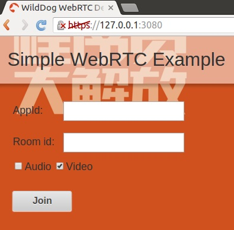
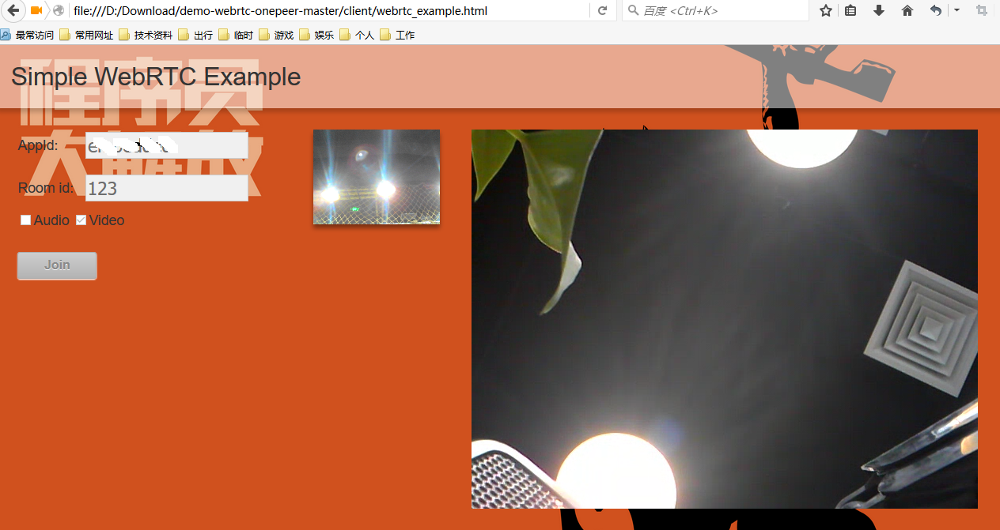
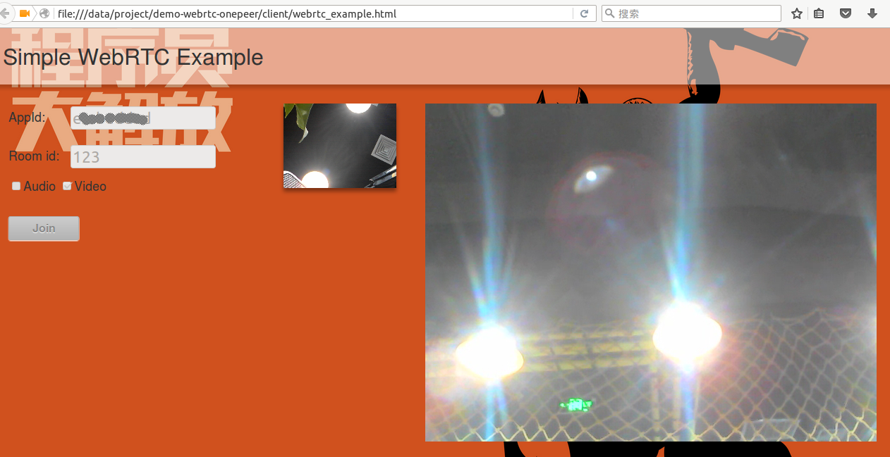

# 使用说明

## 使用 webrtc 聊天室

### 如果使用chrome，开启本地 webserver

本地 webserver 开启的目的是提供一个 web 环境，让网页位于服务器上。
原因是因为调用 webrtc 的 getUserMedia 函数的 HTML 文件要放在服务器上，否则调用该函数会得到一个NavigatorUserMediaError 的错误，显示 PermissionDeniedError。

这里使用 nodejs 来搭建一个本地服务器：

http 服务器：

	node channel_server.js

https 服务器：

	node https_channel_server.js

推荐使用 https 服务器，因为chrome浏览器最近版本都要求 getUserMedia 必须在https环境下被调用。

### 打开页面

如果使用chrome，打开webserver中的html，如果使用firefox，可以在本地直接打开html。

其中，AppId是在 [Wilddog](https://www.wilddog.com) 申请的应用 id，Room id 则是 即将要进入的房间号，进入同一个房间的用户会建立 webrtc 连接。

点击 join 后就加入房间。

